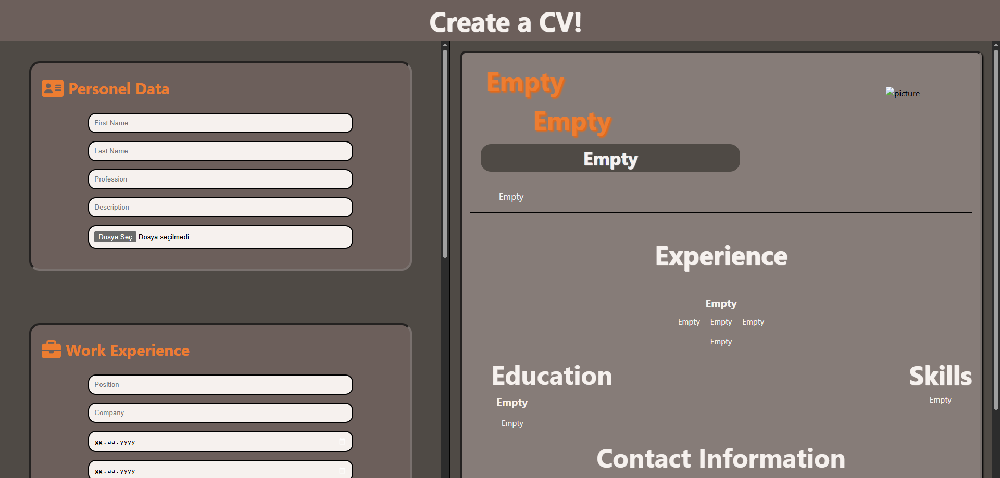
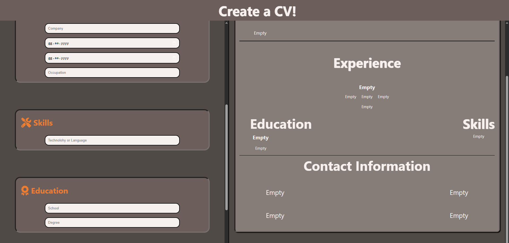

# 📄 CV Application

**CV Application** is a user-friendly web app that allows users to build and preview their CVs in real-time. As users fill in form fields with their personal, educational, and professional information, the CV is generated live on the screen. It’s a handy tool for quickly creating a resume with a clean and structured layout. 

---

## 🎯 Purpose

- 👤 Input personal, educational, and work experience details
- 🧾 See a live preview of your CV as you type
- 🖨️ Prepare your resume for export or printing

---

## 🚀 Features

- 🧩 **Modular Form Sections**
  - Separate fields for personal info, education, and experience
- 🔄 **Live Preview**
  - Updates the CV view instantly as you type
- 🎨 **Clean UI**
  - Minimalistic and readable layout for CV display
- 🧠 **React State Management**
  - Handles dynamic form data smoothly

---

## 🛠️ Tech Stack

| Layer         | Technologies         |
|---------------|----------------------|
| Frontend      | React, JSX, Vite     |
| Styling       | CSS                  |
| Tools         | Git, GitHub, VS Code |

---


###  Home Page




---
## 📦 Getting Started

Clone the repository and run the app locally:

```bash
git clone https://github.com/kuyucucaner/CV-Application.git
cd CV-Application
npm install
npm run dev
